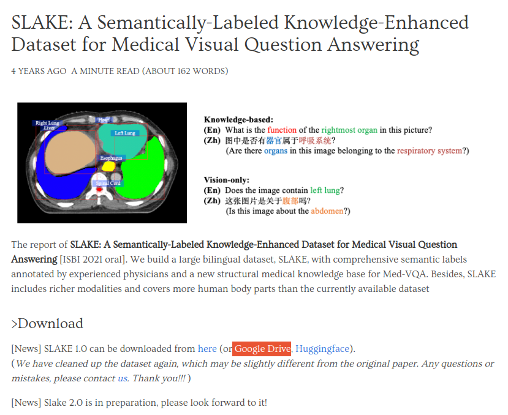
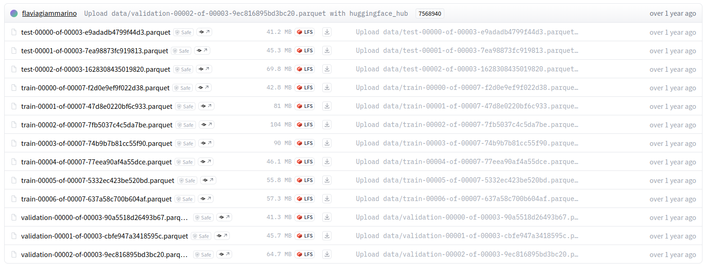

# VQA Data Preparation

## Dataset Download Information

### RadVQA
To download the RadVQA dataset, please visit this [link](https://osf.io/89kps/)

From the below screenshot, please ensure that the entire OSF Storage directory is downloaded.


An execution of the instruction data generation python script is required on the downloaded OSF Storage data directory.

### SLAKE
To download the SLAKE dataset, please visit this [link](https://www.med-vqa.com/slake/)

From the below screenshot, please note that we use the 'Google Drive' link to download the dataset.



Once the dataset is downloaded, please unzip the files and place them in a temporary data directory. Execution of instruction data generation python script is required on the unzipped data directory

### PathVQA
All files from the huggingface PathVQA dataset from the data directory need to be downloaded. Here is the [link](https://huggingface.co/datasets/flaviagiammarino/path-vqa) to the dataset.

Ensure that all 13 parquet files are present in the data directory before trying to generate the instruction data (see screenshot below). The python commands for running them are provided in the next section.



## Generate Instruction Tuning Training Data
### RadVQA
Example command to run generate the instruction training data json file for RadVQA dataset:

```
python radvqa_instruct_data_generate.py \
    --input_json /path/to/VQA_RAD_Dataset_Public.json \
    --output_json /path/to/output/radvqa_instruct.json \
    --data_type train
```

### SLAKE
Example commands to run generate the instruction training data json file for Slake dataset:

Training Instruction Data:
```
python slake_instruct_data_generate.py \
    --input_paths /path/to/slake_dataset/train.json /path/to/slake_dataset/validate.json \
    --output_path /path/to/output/slake_train_val_instruct.json
```
Testing Instruction Data:
```
python slake_instruct_data_generate.py \
    --input_paths /path/to/slake_dataset/test.json \
    --output_path /path/to/output/slake_test_instruct.json
```

### PathVQA
Example command to run generate the instruction training data json file for PathVQA dataset:

```
python pathvqa_instruction_gen_parquet.py --input_path /path/to/input/parquet/files --output_path /path/to/output/processed/dataset
```
Please make sure that the .csv files were succesfully generated from the prior command before running the next command
```
python pathvqa_instruction_generate.py --input_dir /path/to/output/processed/dataset --output_dir /path/to/output_directory
```

### Medical-Diff-VQA (a.k.a MIMIC-VQA)
The data preparation scrips for this dataset have been adopted from the [D-RAX](https://arxiv.org/abs/2407.02604) paper.
Please request access to the data following the instructions on the [PhysioNet.org](https://physionet.org/content/medical-diff-vqa/1.0.0) website.
After downloading the data, you can run our [notebook](./mimicvqa/prepare_json_mimic_vqa.ipynb) to prepare the data for training and evaluation.
```commandline
jupyter lab ./mimicvqa/prepare_json_mimic_vqa.ipynb
```
Note, if you haven't installed JupyterLab, please follow the instructions [here](https://jupyter.org/install).

If you end up using the data preparation and evaluation scripts for Medical-Diff-VQA/MIMIC-VQA in your work, please cite
```
@inproceedings{nisar2024d,
  title={D-Rax: Domain-specific Radiologic assistant leveraging multi-modal data and eXpert model predictions},
  author={Nisar, Hareem and Anwar, Syed Muhammad and Jiang, Zhifan and Parida, Abhijeet and Sanchez-Jacob, Ramon and Nath, Vishwesh and Roth, Holger R and Linguraru, Marius George},
  booktitle={International Workshop on Foundation Models for General Medical AI},
  pages={91--102},
  year={2024},
  organization={Springer}
}
```